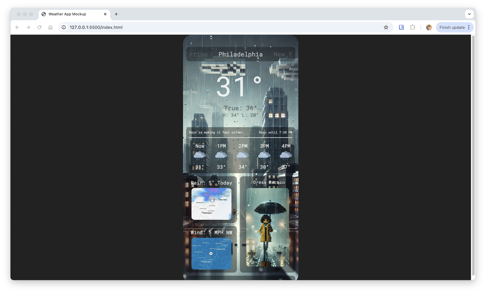

# CoolWeather

Thanks for visiting. The code in this repo is an HTML/CSS prototype for a weather app designed for an assignment in CIS 4120. 

# Sources

I used the following resources to assist in the creation of this project: 

MDN Web Docs - Documentation on how to use grid layouts, flex layouts, and scroll bars

ChatGPT 4 - For image generation and setting up the phone sizing of the page, information on how to center the overlay and add click listeneres in Javascript

Canva - For the weather icons used 

w3schools - Guides on how to setup background images 

Google Fonts - For the font used on this website

Apple Maps - For the map screenshots